# Career_Aspirations_Survey_Analysis

## Overview

This project focuses on analyzing a survey dataset on the career aspirations of GenZ. The analysis includes demographic insights, factors influencing career choices, interest in higher education, work preferences, and more, using various data visualization techniques.

## Data Preparation

### Reading and Preprocessing the data:
- Load the survey data from a CSV file.
- Generate descriptive statistics for the dataset.

## Exploratory Data Analysis (EDA) performed:

### Demographics Analysis:

#### Current Country:
- To check how diverse is the dataset.

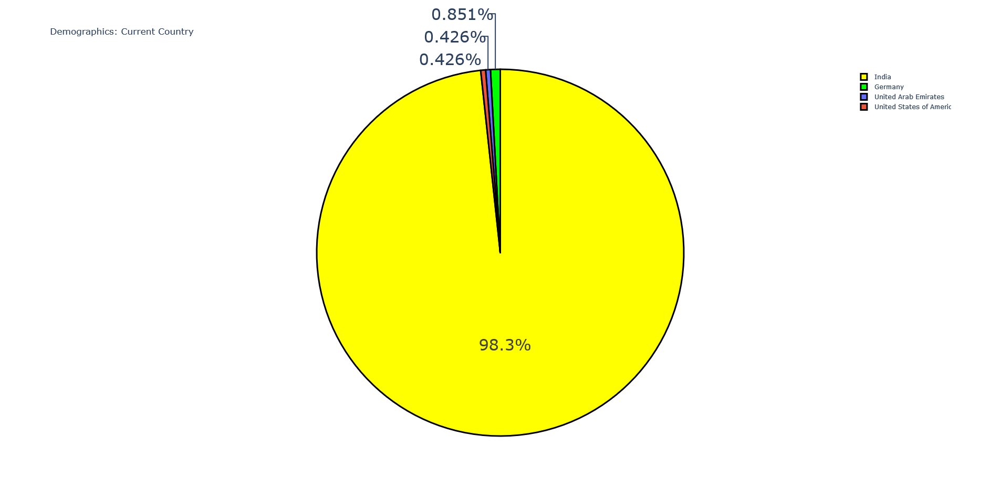

#### Gender:
- To visualize the gender distribution of respondents.

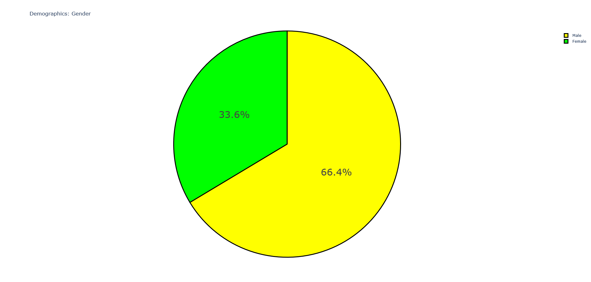

### Career Aspirations and Preferences:

#### Factors Influencing Career Aspirations:
- To analyze the factors influencing career aspirations of the respondents.

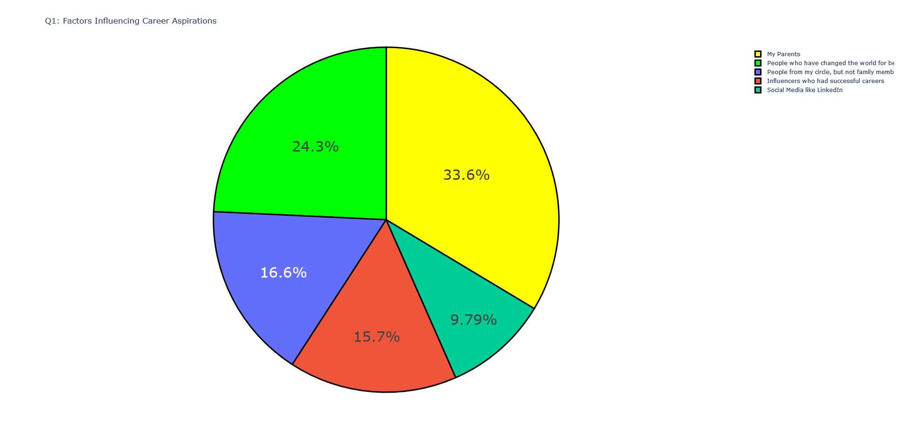

#### Interest in Self-Sponsored Higher Education:
- To analyze if respondents are interested in pursuing higher education outside of India with self-sponsorship.

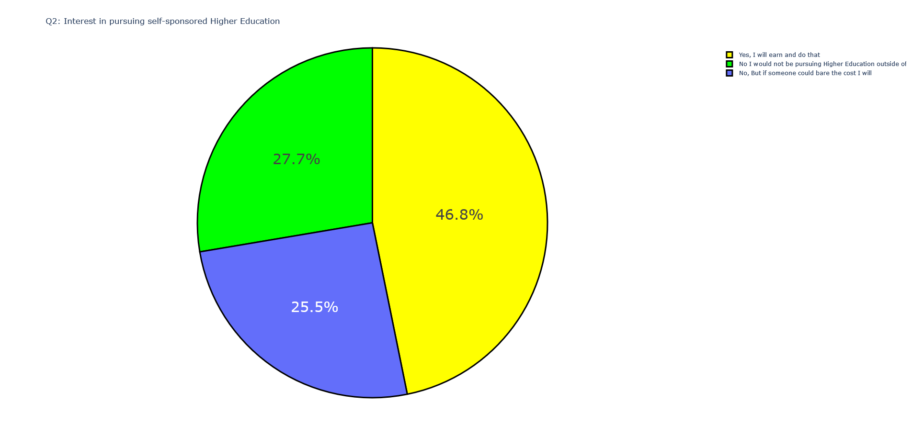

#### Willingness to Work for One Employer for 3+ Years:
- To analyze the likelihood of respondents working for a single employer for 3 years or more.

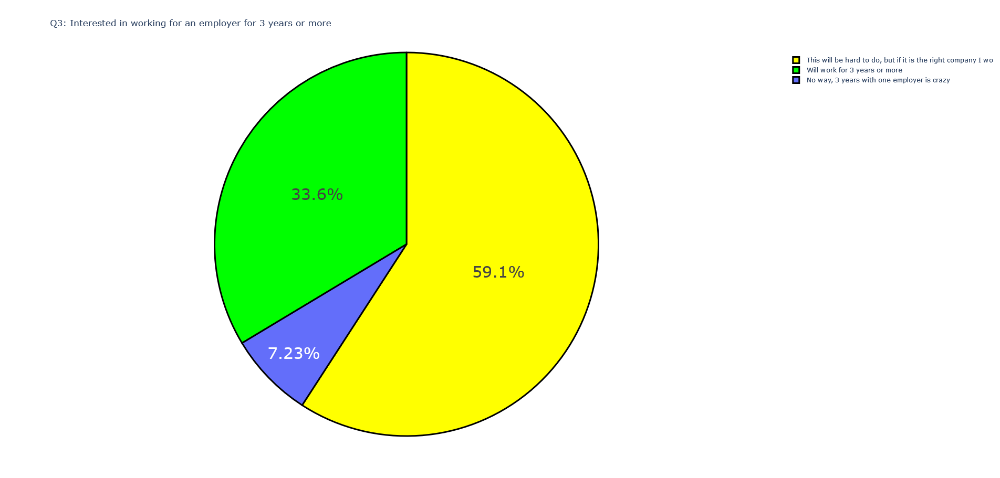

#### Willingness to Work for an Employer Without a Clearly Defined Mission:
- To analyze the willingness of respondents to work for an employer without a clearly defined mission.

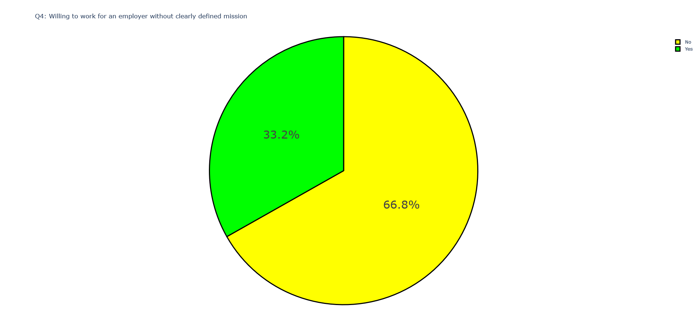

#### Willingness to Work for an Employer Whose Mission Misaligns with Public Actions:
- To analyze the willingness of respondents to work for an employer whose mission misaligns with their public actions.

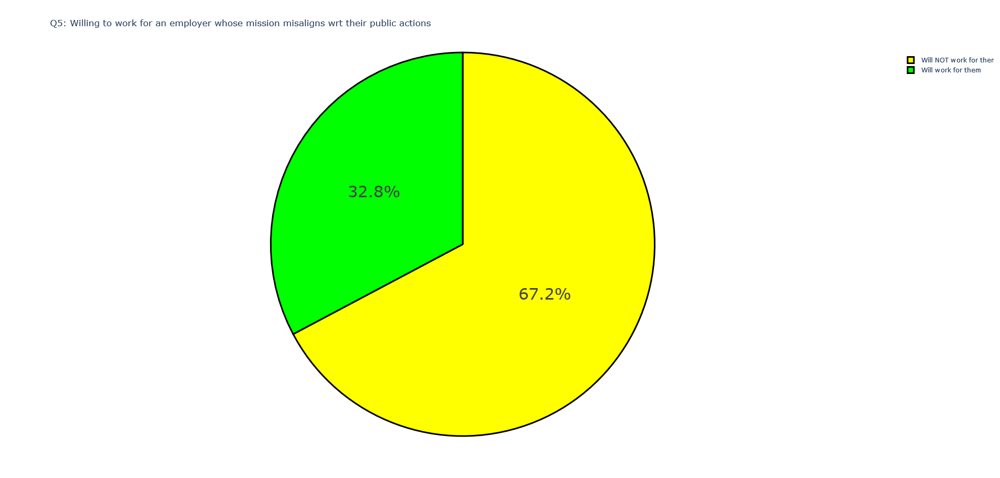

#### Willingness to Work for an Employer Whose Mission Does Not Bring Social Impact:
- To analyze the willingness of respondents to work for an employer whose mission does not bring social impact.

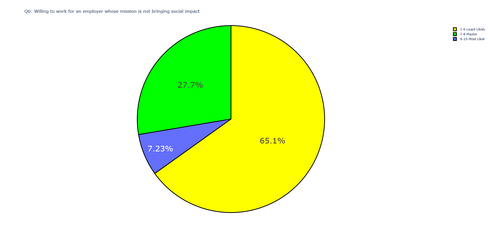

#### Most Preferred Work Environment:
- To analyze what is a preferred work environment for the respondents.

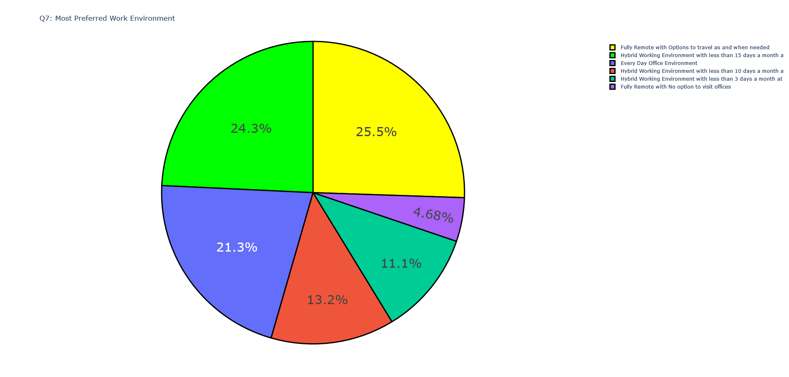

#### Preferred Values in Employers:
- To analyze what values are preferred by the respondents in employers.

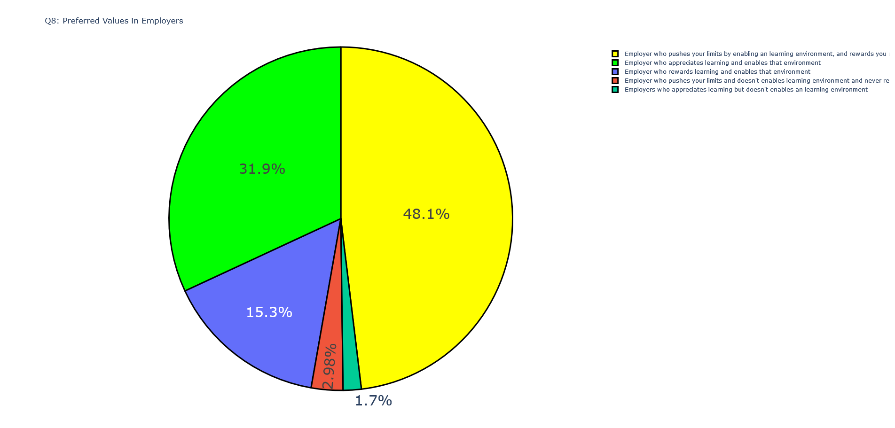

#### Preferred Type of Learning Environment:
- To analyze what are the types of learning environments that respondents prefer.

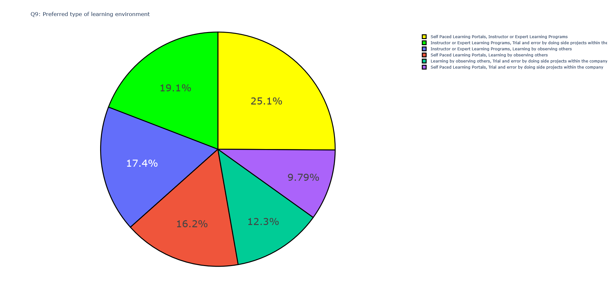

#### Career Aspirations:
- To analyze career aspirations of the respondents.

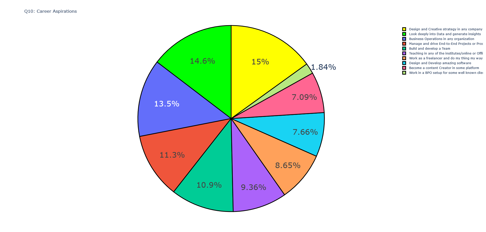

#### Preferred Values in a Manager:
- To analyze what values respondents prefer in their manager.

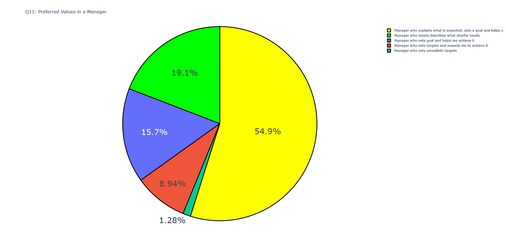

#### Preferred Setup at Work:
- To analyze what are the preferred work setups for the respondents.

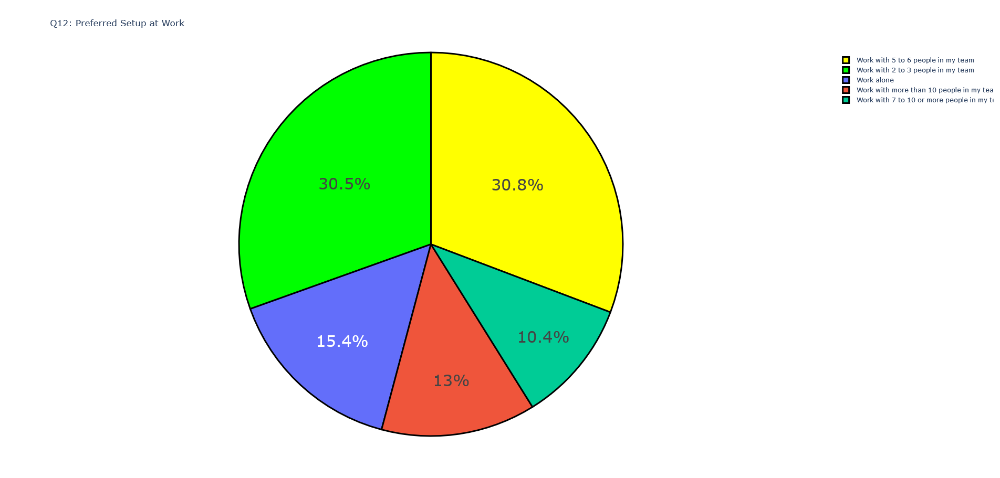

## Conclusion

This project builds on the foundational work provided in The Clever Programmer's Career Aspirations Survey Analysis using Python by expanding the analysis to provide deeper insights into various other aspects of the survey analysis.

## References:
1. [Market Research](https://en.wikipedia.org/wiki/Market_research)
2. [How to do Market Research](https://www.investopedia.com/terms/m/market-research.asp)
3. [Project Reference](https://thecleverprogrammer.com/2023/01/09/career-aspirations-survey-analysis-using-python/)
4. [Dataset](https://www.kaggle.com/datasets/kulturehire/understanding-career-aspirations-of-genz)
